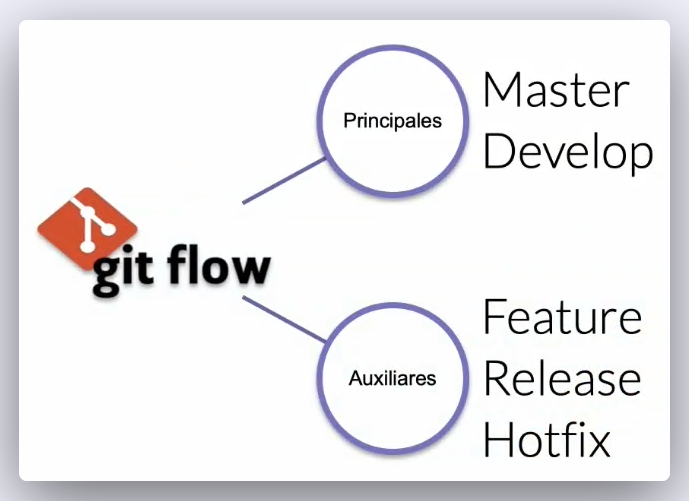
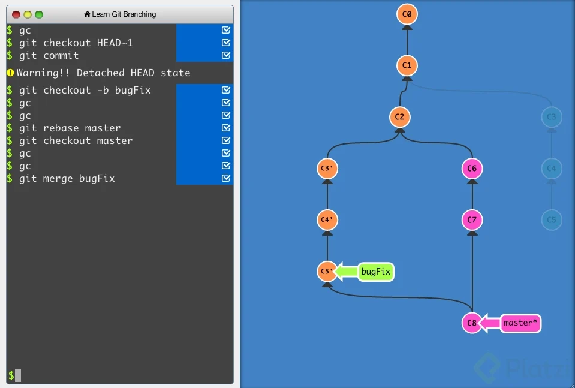

# CLASE 1 MIÉRCOLES 9 DE ABRIL DEL 2025

## Abrimos la terminal de Git Bash en Window o la terminal de Ubuntu, tambien la terminal de Mac, y comenzamos con los siguientes comandos y creación de directorios

```bash
pwd  #Vemos la ruta de la carpeta en la que estamos
```
```bash
cd #Es para navegar a una carpeta: change directory -> cambiar de directorio
```
```bash
cd / #Nos llava al home, en la raíz del disco
```
```bash
cd ~ #La virgulilla significa que estamos en el lugar de los documentos o del usuario
```
```bash
ls #Esto es listar los archivos, nos muestra todos los archivos en la raíz
```
```bash
ls -al #El espacio -al significa que es un argumento especial para ver archivos ocultos
```
### Usar la flecha hacía arriba nos muestra el último comando utilizado
```bash
ls -l #Muestra casi todos los archivos sin los que están ocultos
```
```bash
ls -a #Muestra el grupo de archivos pero no en una lista
```
```bash
clear #Limpia la consola o ctrl + l
```
```bash
cd .. #Nos devuelve a la carpeta anterior
```
```bash
cd U + tab #Esto se usa para un autocompletado o para buscar una referencia
```
```bash
cd /D #Cambiamos de disco en window
```
```bash
df -h #Muestra todos los directorios en Ubuntu
```
```bash
cd /mnt/d #Cambia de directorio usando WSL Ubuntu en window
```


### AHORA COMENZAMOS CON LA CREACIÓN DE CARPETAS

```bash
cd ..
```
```bash
cd ..
```
```bash
cd /mnt/c
```
```bash
cd ~ #Vamos a la raíz
```
```bash
mkdir Tecnicatura #Recordar que en window las mayúsculas no tienen relevancia, pero si en Linux
```
```bash
cd tecnicatura
```
```bash
mkdir Python
```
```bash
mkdir Java
```
```bash
mkdir JavaScript
```

# CLASE 2 MIÉRCOLES 16 DE ABRIL DEL 2025

### Abrir git bash en Window o la terminal de Linux o de Mac: al abrir Git Bash hacerlo como administrador

```bash
touch vacio.txt #Crea un archivo con su extención: ESCRIBIR DENTRO
```
```bash
ctrl + s #Guardamos lo que escribimos en el archivo
```
```bash
./ #Significa la carpeta actual
```bash
../ #Significa la carpeta anterior
```
```bash
cat vacio.txt #Vemos el contenido del archivo
```
```bash
history #Veremos la historia completa de los comandos que hemos utilizado
```
```bash
!72 + enter #Veremos el comando que utilizamos en ese número
```
```bash
rm vacio.txt #Borra el archivo seleccionado, ¡¡¡¡CUIDADO!!!!
```
```bash
rm --help #Muestra como funciona el comando
```

## CREAR UN REPOSITORIO DE GIT Y HAZ TU PRIMER COMMIT

```bash
cd tecnicatura
```
```bash
mkdir class-git
```
```bash
cd class-git #Entramos en la carpeta que necesitamos trabajar
```
```bash
git init #Creamos un repositorio en la carpeta central, se crea el archivo .git
```
```bash
code .  #Abrimos VSC, el punto hace que se abra el archivo en el que estamos situados
```
```bash
ctrl + n #Creamos un archivo nuevo y escribimos en el, como lo hicimos antes
```
```bash
ctrl + s #Guardamos poniendo el nombre: historia.txt
```
```bash
git status #Vemos el estado del proyecto en tiempo real, esta en el área de trabajo
```
```bash
git add historia.txt #Enviamos el archivo al área de preparación
```
```bash
git status #Para ver el estado de cambios
```
```bash
git rm --cached historia.txt #Quitamos el archivo del área de preparación, cached significa que esta en memoria ram
```
```bash
git config #Tedremos la lista de como funciona la configuración
```
```bash
git config --list #Configuraciones por defecto, faltan cosas importantes
```
```bash
git config --list --show-origin #Veremos donde están las configuraciones guardadas
```
```bash
git config --global user.name "Matias Altamiranda"
```
```bash
git config --global user.email "matiasemanuel25@gmail.com" #El correo debe ser el mismo que usaremos en GitHub
```
```bash
git config --list #Ahora veremos que ya están todos los datos completos
```
```bash
git add . #Ingresamos todos los archivos al área de preparación (ram)
```
```bash
git commit -m "Mensaje importante del commit" #El primer commit esta hecho
```
```bash
code . #Hacemos cambios en el archivo y guardamos
```
```bash
git status #Hay cambios para commitear
```
```bash
git add .
```
```bash
git commit -m "Mi segundo commit"
```
```bash
git log historia.txt #Vemos toda la historia de este archivo, el número largo es el hash del commit
```

# 📚 Clase 3 – Miércoles 23 de abril del 2025

## Analizar cambios en los archivos del proyecto Git (Parte 3)

---

### Ingresamos de la siguiente manera:

Abrir git bash en Window o la terminal de Linux o de Mac: al abrir Git Bash hacerlo como administrador, en terminal también o usar sudo para permisos especiales.

```bash
cd tecnicaturagit  #Ingresamos al direcotorio donde están nuestras carpetas de trabajo
```
```bash
ls   #Vemos los archivos y directorios que ya tenemos
```
```bash
cd git   #No hay nada
```
```bash
cd ..   #Salimos
```
```bash
rm historia.txt   #Eliminamos el archivo que habíamos hecho, esto en git bash (window) esto es para practica
```
```bash
rm Git   #rm: cannot remove 'Git': Is a directory
```
```bash
rm --recursive -R Git   #By default, rm does not remove directories.  Use the --recursive (-r or -R) arguments option to remove each listed directory, too, along with all of its contents. Esto es para practica
```
```bash
rm --help #Nos muestra lo que les puse arriba como documentación en Inglés.
```
```bash
mkdir class-git #Creamos la carpeta o directorio para trabajar en Git local por ahora.
```
```bash
cd class-git #Entramos para crear el README.md para este sector.
```
```bash
touch README.md #Vamos a crear un archivo nuevo, md significa markdown y se pueden trabajar con editores de texto, este es un lenguaje que transforma el texto a html.
```
---
Enlace a la documentación en GitHub de MARKDOWN

https://docs.github.com/es/get-started/writing-on-github/getting-started-with-writing-and-formatting-on-github/basic-writing-and-formatting-syntax

Leemos la documentación para ir creando en README.md como lo enseña GitHub.

---
Seguimos...

```bash
code . #Abrimos VSC para editar el archivo.
```
Empezamos a cargar lo visto en las clases anteriores (Comandos) en el README y pasamos a commitear

```bash
git status
```
```bash
git add .
```
```bash
git status
```
```bash
git commit -m "Cargamos el README dentro del directorio class-git"
```
```bash
git status
```
```bash
git log #Para ver los dos commits hechos: Si tienes commiteada alguna clase anterior veras mas commits de los que yo tengo.
```
```bash
cd ..
```
```bash
cd ..
```
---

## 📎 Recursos útiles

📄 [Documentación oficial de Markdown en GitHub](https://guides.github.com/features/mastering-markdown/)

---

# 📚 Clase 4 – Miércoles 30 de abril del 2025

## Tema: Analizar cambios en los archivos del proyecto Git (Parte 4)

---
Ingresamos de la siguiente manera:

Abrir git bash en Window o la terminal de Linux o de Mac: al abrir Git Bash hacerlo como administrador, en terminal también o usar sudo para permisos especiales.

TAREA -> AGREGAR LOS COMENTARIOS EN LOS COMANDOS, PARA SABER QUE PASA CON CADA UNO.
```bash
cd tecnicatura

cd class-git

ls

touch historia.txt

code .   #abre visual studio
```
#### --> Modificamos el archivo historia.txt colocando lo siguiente: Bienvenido     mi nombre es Matias (coloca tu nombre)

```bash
ctrl + s    #guardamos

git status

git add .

git status

git commit #Sin agregar -m veremos que pasa
```

#### --> Agregar mensaje y salir con
```bash
Esc #Presionamos Escape 

:wq! + enter #Y ya salimos si estamos en git bash con window

Esc + shift + z + z #Salimos del mensaje para el commit, en linux, esto anda en algunas terminales
```
#### --> Agregamos otra línea de mensaje en historia.txt desde VSC: estoy estudiando programación
```bash
ctrl + s   #guardamos

git add .

git commit
```
####  --> Se abre un editor de código basado en línea de comandos, editor de texto como VSC llamado vim
```bash
Esc + i #Para comenzar a escribir mensaje del commit, no suele ser necesario

ctrl + x #Para salir en linux

s + enter #Para decir si al cambio y aceptar el nombre, ósea no cambiamos el nombre, la (s) es de si y la (y) es de yes, no olvidar enter en linux

git show #Vemos todos los cambios en el último commit

git log historia.txt #Vemos todos los commit

q #Para salir del registro de commits
```
#### --> Copiamos un hash mas antoguo y otro reciente, ingresamos el siguiente comando
```bash
git diff hash_commit_numerico hash_commit_numerico #Comparamos diferentes commits y sus cambios, poner la versión mas vieja primero, luego la mas nueva

q #Para salir
```
```bash
cd ..

cd ..
```

---> La tarea de hoy, agregar esta clase al README.md con el lenguaje de markdown, como lo hicimos en la clase pasada, luego deben hacer el commit correspondiente al cambio agregado. <---

---
---
# 📚 Clase 5 – MIÉRCOLES 7 DE MAYO DEL 2025
---

## ¿Qué es el staging?

Tienes una carpeta donde están los archivos de tu proyecto o un directorio y allí tenemos el archivo historia.txt, cuando entramos por consola a ese archivo y creamos el git init, se crea un área en memoria ram que se llama staging, y el otro es el repositorio esta es la carpeta .git donde estarán todos los cambios al final del proyecto.


Entonces tenemos el área de trabajo, cuando colocamos git add historia.txt pasamos al staging o área de preparación, que hay que recordar que esto es en la memoria ram y luego con git commit -m "Mensaje" pasa al repositorio en la rama master, allí se genera un nombre llenos de letras y números, es el hash, el nombre del commit.





## ¿Qué es Gitflow?
Gitflow es un modelo alternativo de creación de ramas en Git en el que se utilizan ramas de función y varias ramas principales. Fue Vincent Driessen en nvie quien lo publicó por primera vez y quien lo popularizó.

## ¿Qué es branch (rama) y cómo funciona un merge en git?

Tenemos una rama llamada master y es donde están los cambios de nuestros archivos, con cada commit creamos una nueva versión


Vamos a crear una rama experimental para otras versiones que suele llamarse development, al encontrar bug, se crea otra rama que suele llamarse hotfix para hacer reparaciones, siempre que ya tengamos resultados favorables, es donde decidimos hacer un merge, es unir los resultados de las ramas a la rama master.


La principal característica de las ramas principales es que solo existe una de cada tipo. El objetivo es que no se instancien y que no reciban código de forma directa a través de commit, siempre tienen que recibir código a través de ramas de tipo Feature, Release y Hotfix, siempre a través de ramas auxiliares.

Es un riesgo recibir código directamente en la rama Master, porque puede generar defectos en el repositorio en las subidas a producción, que no contemplemos o que no preveamos, por lo que siempre es mejor integrar código en otras ramas antes de integrar con las ramas Master y Develop.

Esta es una metodología estricta pero que da lugar a diferentes interpretaciones o diferentes formas de llevarla en cada equipo, por lo que en algunos casos, algún experto puede permitirse no seguir esa norma, pero son casos muy específicos y siempre de personas de confianza.

En las ramas auxiliares tenemos la rama Feature, la rama Release y la Rama Hotfix, que puede instanciarse todas las veces que se consideren necesarias:

La rama Feature, para nuevas características, nuevos requisitos o nuevas historias de usuario.
La rama Release, para estandarizar o cortar una serie de código que ha estado desarrollándose en la rama Develop, se saca una rama de este tipo, se mergea y ahí se depura.
La rama Hotfix, que habitualmente se utiliza para código para depurar el código que venga de producción, por haberse detectado un defecto crítico en producción que deba resolverse, al que se le va a hacer una Release puntual para corregirlo.
Estas ramas tienen un principio y un fin, ya que son ramas que se mergean con las ramas Master y Develop y desaparecen.


Podemos tener tantas ramas como queramos, tantos repositorios como queramos, lo más importante es saber cuando hacemos un merge, porque es posible que hayan archivos que rompan otros archivos, a esto se lo llama conflicto o bug.

---
---
# 📚 Clase 6 – Miércoles 14 de mayo del 2025

## Tema: Volver en el tiempo con Git – Uso de `reset` y `checkout`

---

### 🖥️ Ingreso al entorno

1. Abrimos Git Bash en Windows (como administrador) o terminal en Linux/macOS.
2. Entramos al proyecto:
   ```bash
   cd tecnicatura
   cd class-git
   ls
   ```

3. Creamos archivo de práctica:
   ```bash
   touch historia.txt
   cd ..
   code .
   ```

---

## 📝 Hacemos cambios y usamos `commit`

4. Commiteamos directamente con opción `-a`:
   ```bash
   git commit -a
   ```
   - Se abre el editor `vim`.

5. En el editor:
   - `Esc + i`: entrar en modo edición
   - `Esc`: salir del modo edición
   - `:wq!`: guardar y salir

---

## 📜 Historial y uso de `reset`

6. Ver commits:
   ```bash
   git log
   git show
   git log --oneline
   ```

7. Copiar el hash corto y ejecutar:
   ```bash
   git reset hash_commit
   ```
   - Esto realiza un **reset suave** por defecto (`--soft`)

8. Verificamos estado:
   ```bash
   git status
   ```

9. Volvemos a commitear:
   ```bash
   git add .
   git commit -m "Agregamos datos de estudios en historia.txt"
   ```

10. Ver configuración local de Git:
   ```bash
   git config --list
   ```

---

## 🔁 Reset fuerte y suave

11. Usamos `reset --hard` (peligroso):
   ```bash
   git reset --hard hash
   ```

12. Crear, modificar y commitear nuevamente:
   ```bash
   git reset --soft hash
   git diff
   git add .
   git status
   git commit -m "Commiteamos lo último de hoy"
   git log
   ```

---

## ✍️ Últimos cambios en el archivo

13. Modificamos `historia.txt`:
   - Cambiamos la última línea
   - Guardamos con `Ctrl + S`

14. Verificamos cambios:
   ```bash
   git diff
   git commit -am "Cambio en la última línea del historia.txt"
   git log
   q
   ```

15. Ver cambios por archivo:
   ```bash
   git log --stat
   q
   ```

---

## ⏪ Volver a versión anterior con `checkout`

16. Ver estado original:
   ```bash
   git checkout hash
   git status
   ```

17. Volver a la rama principal:
   ```bash
   git checkout master
   ```

18. Volver a cambiar a una versión antigua:
   ```bash
   git checkout hash
   ```

19. Commitear el reemplazo:
   ```bash
   git commit -am "Reemplazo de una versión por otra de la historia"
   git log
   ```

---

## 🌿 Uso de ramas

20. Crear nuevas ramas:
   ```bash
   git branch cambios
   git checkout master
   git branch second
   git branch tuNombre
   git branch hotfix
   git branch
   ```

21. Borrar ramas:
   ```bash
   git branch -d cambios
   git branch -D cambios  # Forzar si no se elimina
   ```

---

## ⬅️ Regresamos al nivel superior

```bash
cd ..
cd ..
```

---

## 📌 Tarea

- Agregar esta clase al archivo `README.md` usando formato Markdown.
- Realizar el commit correspondiente al cambio:

```bash
git commit -m "Agrego resumen de Clase 6 al README.md"
```
---
---
# 📚 CLASE 7 MIÉRCOLES 21 DE MAYO DEL 2025 - Portafolio 1

## Tema: `Git reset` vs `Git` parte 7

---

Los comandos git reset y git rm tienen utilidades muy diferentes, pero pueden confundirse fácilmente.

## GIT RESET

El comando git reset es una herramienta poderosa que te permite deshacer o revertir cambios en tu repositorio de Git. Lo puedes ejecutar de tres maneras diferentes, con las líneas de commando --soft, --mixed y --hard.

Pero como git checkout que nos deja ir, mirar, pasear y volver. Con git reset volvemos al pasado sin la posibilidad de volver al futuro. Borramos la historia y la debemos sobreescribir. No hay vuelta atrás.

Tres árboles en Git Para entender lo anterior, recordemos que los “tres árboles” de Git son estructuras de datos basadas en nodos y punteros que Git utiliza para hacer seguimiento a un cronograma de ediciones, aunque no sean estructuras en forma de árbol en el sentido tradicional.

La mejor forma de entender estos mecanismos es creando un conjunto de cambios en un repositorio y siguiéndolos a través de los tres árboles. Averigüémoslo.

Ingresamos de la siguiente manera:

Abrir git bash en Window o la terminal de Linux o de Mac: al abrir Git Bash hacerlo como administrador, en terminal también o usar sudo para permisos especiales.

TAREA -> AGREGAR LOS COMENTARIOS EN LOS COMANDOS, PARA SABER QUE PASA CON CADA UNO.

Hagan esto si quieren hacer pruebas:

```bash
cd tecnicatura #Vamos a hacer pruebas, es por esto que creamos una carpeta nueva

cd practicas #Entramos en la carpeta

touch reset_file.txt #Agregar información y hacer uno a dos commits

git add reset_file.txt

git add .

git commit -m"Iniciando el primer commit"
```

#Comenzar con las pruebas de git reset

## ¿Cómo funciona Git Reset en tu flujo de trabajo? 

Git reset permite moverte entre diferentes commits para deshacer o rehacer cambios. Git guarda todo lo nuevo del repositorio como commits, que son instantáneas del estado del código en un momento dado y existen variaciones de este comando.

### `Variaciones de Git Reset` 


git reset --soft: Borra el historial y los registros de Git de commits anteriores, pero guarda los cambios en Staging para aplicar las últimas actualizaciones a un nuevo commit. 

git reset --hard: Deshace todo, absolutamente todo. Toda la información de los commits y del área de staging se elimina del historial. 

git reset --mixed: Borra todo, exactamente todo. Toda la información de los commits y del área de staging se elimina del historial. 

git reset HEAD: El comando git reset saca archivos del área de staging sin borrarlos ni realizar otras acciones. Esto impide que los últimos cambios en estos archivos se envíen al último commit. Podemos incluirlos de nuevo en staging con git add si cambiamos de opinión. Ten en cuenta que, si deshaces commits en un repositorio compartido en GitHub, estarás cambiando su historia y esto puede causar problemas de sincronización con otros colaboradores.

### `¿Qué es git reset HEAD?`


git reset HEAD es un comando que te permite revertir los cambios que ya habías preparado para subir, y moverlos de vuelta a tu proyecto. Con este comando puedes cancelar los cambios que ya habías agregado, para que puedas revisarlos, modificarlos o deshacerlos antes de confirmarlos con un commit.

git rm Por otro lado, es un comando que nos ayuda a eliminar archivos de Git sin eliminar su historial del sistema de versiones. Para recuperar el archivo eliminado, necesitamos retroceder en la historia del proyecto, recuperar el último commit y obtener la última confirmación antes de la eliminación del archivo.

Es importante tener en cuenta que git rm no puede usarse sin evaluarlo antes. Debemos usar uno de los flags siguientes para indicarle a Git cómo eliminar los archivos que ya no necesitamos en la última versión del proyecto.

#### `Variaciones de Git rm`


git rm --cached: Elimina archivos del repositorio local y del área de staging, pero los mantiene en el disco duro. Deja de trackear el historial de cambios de estos archivos, por lo que quedan en estado untracked, que significa: que un archivo no está siendo rastreado por Git

git rm --force: Elimina los archivos de Git y del disco duro. Git guarda todo, por lo que podemos recuperar archivos eliminados si es necesario (empleando comandos avanzados). ¡Al usar git rm lo que haremos será eliminar este archivo completamente de git!

#### `¿Cuál es la diferencia entre git rm y git reset Head? `


La diferencia principal entre git rm y git reset HEAD radica en que git rm elimina archivos del repositorio y de la historia del proyecto, mientras que git reset saca los cambios del área de preparación y los mueve del espacio de trabajo, sin afectar la historia del repositorio.

Es importante tener en cuenta el efecto que cada comando tiene en el proyecto y usarlos según tus necesidades y objetivos específicos.

#### `¿Cuándo utilizar git reset en lugar de git revert? `


Para reescribir la historia del repositorio y eliminar confirmaciones anteriores, se utiliza git reset. Para deshacer cambios de confirmaciones anteriores de forma segura sin modificar la historia del repositorio, se emplea git revert.

Resumen Para evitar problemas en el trabajo, es valioso entender las implicaciones y riesgos de cada comando y elegir el enfoque adecuado según las necesidades y el flujo de trabajo del proyecto.

Con git rm eliminamos un archivo de Git, pero mantenemos su historial de cambios. Si no queremos borrar un archivo, sino dejarlo como está y actualizarlo después, no debemos usar este comando en este commit.

Empleando git reset HEAD, movemos los cambios de Staging a Unstaged, pero mantenemos el archivo en el repositorio con los últimos cambios en los que hicimos commit. Así, no perdemos nada relevante.

Siguientes pasos Bueno, todos los cambios están en el área de Staging, incluido el archivo con los cambios que no están listos. Esto significa que debemos sacar ese archivo de Staging para poder hacer commit de todos los demás.

Crear cambios en el archivo creado, donde vamos a hacer varios commits, para ir probando los nuevos comandos, al finalizar las pruebas, eliminar el directorio con todo su contenido.

---
La tarea de hoy, agregar esta clase al README.md con el lenguaje de markdown, como lo hicimos en la clase pasada, luego deben hacer el commit correspondiente al cambio agregado.

---
### PORTAFOLIO

Vamos a ver unos videos de como avanzar en lo que es un portafolio por el Tutor:

Dante Nicolás Martinez

Parte 1: [Introduccion](https://drive.google.com/file/d/1vy526naHzKlwt6GPLswH1_WWL0BhdMvx/view?usp=drive_link) y [Practica](https://drive.google.com/file/d/1Th4mtUl-Hp6O6oXjKJ-imVbQbLNpFK9x/view?usp=drive_link). >>[PDF](https://drive.google.com/file/d/1oLSdOavVUgkHLChYihGw_JBxL03QCqAr/view?usp=drive_link)

---
---
# 📚 CLASE 8 MIÉRCOLES 28 DE MAYO DEL 2025 - Portafolio 2

## Tema: `Flujo de trabajo básico con un repositorio remoto` parte 8

---

Cuando empiezas a trabajar en un entorno local, el proyecto vive únicamente en tu computadora. Esto significa que no hay forma de que otros miembros del equipo trabajen en él.

Para solucionar esto, utilizamos los servidores remotos: un nuevo estado que deben seguir nuestros archivos para conectarse y trabajar con equipos de cualquier parte del mundo.

Estos servidores remotos pueden estar alojados en GitHub, GitLab, BitBucket, entre otros. Lo que van a hacer es guardar el mismo repositorio que tienes en tu computadora y darnos una URL con la que todos podremos acceder a los archivos del proyecto. Así, el equipo podrá descargarlos, hacer cambios y volverlos a enviar al servidor remoto para que otras personas vean los cambios, comparen sus versiones y creen nuevas propuestas para el proyecto.

Esto significa que debes aprender algunos nuevos comandos

`Comandos para trabajo remoto con GIT`

```bash
git clone url_del_servidor_remoto #Nos permite descargar los archivos de la última versión de la rama principal y todo el historial de cambios en la carpeta .git

git push #Luego de hacer git add y git commit debemos ejecutar este comando para mandar los cambios al servidor remoto.

git fetch #Lo usamos para traer actualizaciones del servidor remoto y guardarlas en nuestro repositorio local (en caso de que hayan, por supuesto).

git merge #También usamos el comando git merge con servidores remotos. Lo necesitamos para combinar los últimos cambios del servidor remoto y nuestro directorio de trabajo.

git pull #Básicamente, git fetch y git merge al mismo tiempo.
```

`Adicionalmente, tenemos otros comandos que nos sirven para trabajar en proyectos muy grandes:`

```bash
git log --oneline #Te muestra el id commit y el título del commit.

git log --decorate #Te muestra donde se encuentra el head point en el log.

git log --stat #Explica el número de líneas que se cambiaron brevemente.

git log -p #Explica el número de líneas que se cambiaron y te muestra que se cambió en el contenido.

git shortlog #Indica que commits ha realizado un usuario, mostrando el usuario y el título de sus commits.

git log --graph --oneline --decorate --all

git log -3 #Limitamos el número de commits.

git log --after=“2018-1-2”

git log --after=“today” 

git log --after=“2018-1-2” --before=“today” #Commits para localizar por fechas.

git log --author=“Name Author” #Commits hechos por autor que cumplan exactamente con el nombre.

git log --grep=“INVIE” #Busca los commits que cumplan tal cual está escrito entre las comillas.

git log --grep=“INVIE” –i #Busca los commits que cumplan sin importar mayúsculas o minúsculas.

git log – index.html #Busca los commits en un archivo en específico.

git log -S “Por contenido” #Buscar los commits con el contenido dentro del archivo.

git log > log.txt #guardar los logs en un archivo txt
```

---

La tarea de hoy, agregar esta clase al README.md con el lenguaje de markdown, como lo hicimos en la clase pasada, luego deben hacer el commit correspondiente al cambio agregado.

---

### PORTAFOLIO

Vamos a ver unos videos de como avanzar en lo que es un portafolio por el Tutor:

Dante Nicolás Martinez

Parte 2: [Introduccion](https://drive.google.com/file/d/1jtIod0pcSsWzQCMoNoW1IUCNSsBQ95x9/view?usp=drive_link) y [Practica](https://drive.google.com/file/d/14_OlorpBLDiYHzcpsqavLhQ0tRlaCN93/view?usp=drive_link) >> [PDF](https://drive.google.com/file/d/1eUZKN_15OX4IPUlyk5sQfLeiEsjVYIxZ/view?usp=drive_link)

---
---
# 📚 CLASE CLASE 9A 
# MIÉRCOLES 4 DE JUNIO DEL 2025 - Portafolio 3

## Tema: `Introducción a las ramas o branches de Git` parte 9

---

Cuando entramos en el proyecto veremos que nos encontramos con la rama master, y es a partir de allí que debe saber que esta es la rama madre o principal rama, y las otras ramas se crean para no afectar a la master


Las ramas (branches) son la forma de hacer cambios en nuestro proyecto sin afectar el flujo de trabajo de la rama principal. Esto porque queremos trabajar una parte muy específica de la aplicación o simplemente experimentar.

La cabecera o HEAD representan la rama y el commit de esa rama donde estamos trabajando. Por defecto, esta cabecera aparecerá en el último commit de nuestra rama principal. Pero podemos cambiarlo al crear una rama (git branch rama, git checkout -b rama) o movernos en el tiempo a cualquier otro commit de cualquier otra rama con los comandos (git reset id-commit, git checkout rama-o-id-commit).

### Repasa: ¿Qué es Git?

#### `Cómo funcionan las ramas en GIT`

Las ramas son la manera de hacer cambios en nuestro proyecto sin afectar el flujo de trabajo de la rama principal. Esto porque queremos trabajar una parte muy específica de la aplicación o simplemente experimentar.

```bash
git branch nombre-rama #Con este comando se genera una nueva rama.

git checkout nombre-rama #Con este comando puedes saltar de una rama a otra.

git checkout -b rama #Genera una rama y nos mueve a ella automáticamente, Es decir, es la combinación de git branch y git checkout al mismo tiempo.

git reset id-commit #Nos lleva a cualquier commit no importa la rama, ya que identificamos el id del tag., eliminando el historial de los commit posteriores al tag seleccionado.

git checkout rama-o-id-commit #Nos lleva a cualquier commit sin borrar los commit posteriores al tag seleccionado.
```


Vamos a hacer una practica: mientras la rama master esta cambiando normalmente, vamos a crear una rama paralela que va a crear nuevas secciones: osea una sección y a esta rama la vamos a llamar segunda(second) y con esto, la vamos a fusionar para ver como queda en la rama master y así entender el flujo de ramas entre git. Al crear otra rama estamos creando una copia de todos los commit que ya tiene la rama master en la nueva rama y todos los cambios que hagamos en esta nueva rama, no los va a ver la rama master, hasta que no la volvamos a fusionar con un proceso que se llama merge.

`Abrir terminal #En ubuntu`

`Abrir como adminstrados git bash #En windows`
```bash
cd Tecnicatura

cd class-git

code . #En ubuntu

code . #En window, abrir como administrador, generar cambios desde VSC

touch index.html #Cargamos un h1 con nuestro nombre

ctrl + s #Guardamos

clic mouse derecho #Abrimos en el navegador con Live Server vemos los cambios

git status

git commit -am "mensaje del commit" #Este solo funciona con archivos creado previamente

git commit -a -m "Mensaje del commit" #Esto es lo mismo que el anterior

git commit -a + enter #Se abrira el entorno para editar el vim con el mensaje

esc + i #Escribir el mensaje

esc

:wq! #esto en window

ctrl + x #Esto en linux

s + enter #No cambiar el nombre ni ruta de ubicación

git log #Veremos los cambios guardados

q #Para salir

git log --stat #Veremos los cambios nombrando cada archivo

q #Para salir

git branch #Muestra en la rama que estamos, desde aquí crearemos una nueva

git show #Muestra el último cambio que hicimos, esto significa que desde el HEAD -> master es que haremos cambios

q #Para salir

ctrl + l #Limpiamos consola

git branch second #creamos una nueva rama llamada second

git show #Nos muestra ahora que esta en el HEAD -> master, cabecera aquí es donde esta apuntando, es decir el último commit esta pegado a dos ramas distintas, aunque todavía estemos en master

q #Para salir

git status #No hay nada para hacer commit

git chekout second #Nos movemos hacía otras ramas, en este caso a second, esto no se ve en mac ni en ubuntu, para ver donde estamos hay que ingresar...

git branch #veremos en que rama estamos ubicados o ingresando...

git status #Veremos en que HEAD estamos apuntando

VSC #hacemos cambios que veremos con Nico
```
---

### PORTAFOLIO

Vamos a ver unos videos de como avanzar en lo que es un portafolio por el Tutor:


Dante Nicolás Martinez

Parte 2: [Introduccion](https://drive.google.com/file/d/1GTgBvcXdcvqbMv9clAKnIJV6loImMBau/view?usp=drive_link) y [practica](https://drive.google.com/file/d/1bKooxCwiQiLmgo9GBQYgl90K76v3MW7g/view?usp=drive_link). >> [PDF](https://drive.google.com/file/d/1R9Mn7symS9c6GuoPuO3qU_jnMWp2od0a/view?usp=drive_link)

---

Coontinuamos con los comandos...

```bash
ctrl + s  #Guardamos la clase del portafolio

F5 #Actualizamos en el navegador para ver los cambios

git status #Veremos el archivo que modificamos

git add .

git commit

esc + i #Abrimos el editor vim, escribimos el mensaje del commit

esc

:wq! #En window

ctrl + x #En linux

s #Para un si 

enter #Terminado el mensaje del commit

git status #No hay mas nada para commitear y estamos en la rama segunda

git show #Vemos todo lo que cambiamos

q #Para salir

git log #Nos muestra donde estabamos con la rama master y el HEAD paso a la rama cabecera

q #Para salir

git checkout master #Volvemos a la rama master, desaparese lo que habíamos hecho

git log #No muestra lo que hicimos en el portafolio

q #Para salir


git checkout segunda #Volvemos a ver todos los cambios que hicimos de nuevo
```

La tarea de hoy, agregar esta clase al README.md con el lenguaje de markdown, como lo hicimos en la clase pasada, luego deben hacer el commit correspondiente al cambio agregado.

---
---
# 📚 CLASE 9-B 
# MIÉRCOLES 4 DE JUNIO DEL 2025 - Portafolio 4 

## Tema: `Fusión de ramas con Git merge` parte 10

---

La fusión en Git es la forma en que este sistema une un historial bifurcado. El comando git merge permite integrar líneas de desarrollo independientes generadas por git branch en una sola rama. Con este comando, podemos crear un nuevo commit que combina dos ramas o branches: la rama actual y la rama que se indica después del comando.

Estos comandos de fusión del merge afectan solo a la rama actual y no a la rama de destino. Por lo tanto, te recomendamos utilizar git checkout para seleccionar la rama actual y git branch -d para eliminar la rama de destino obsoleta.


## Funcionamiento de Git merge

Git merge fusiona secuencias de confirmaciones en un solo historial, generalmente para combinar dos ramas. Busca una confirmación de base común y genera una confirmación de fusión que representa la combinación de las dos ramas hasta el resultado final.



## ¿Cómo unir dos ramas en git?

Ahora bien, para combinar ramas en tu repositorio local, usa git checkout para cambiar a la rama donde deseas fusionar. Por lo general, esta es la rama principal. Luego, emplea git merge y especifica el nombre de la otra rama que deseas traer a esta rama. Ten en cuenta que esto es una combinación de avance rápido.

## ¿Cómo realizar un merge en git?

Para hacer un merge en Git, primero asegúrate de estar en la rama correcta. Después, usa el comando git merge seguido del nombre de la rama que quieres combinar. Por ejemplo, si quieres crear un nuevo commit en la rama master con los cambios de la rama segunda, usa este comando:

```bash
git checkout master

git merge segunda
```


Es importante tener en cuenta que en caso de haber conflictos, debes guardar tus cambios antes de hacer git checkout para evitar perder tu trabajo. También es recomendable emplear los comandos básicos de GitHub, como git fetch, git push y git pull, para mantener actualizado tu repositorio.

En este ejemplo, vamos a crear un nuevo commit en la rama master combinando los cambios de una rama llamada segunda: Otra opción es crear un nuevo commit en la rama segunda combinando los cambios de cualquier otra rama:

Git es asombroso porque puede saber cuáles cambios deben conservarse en una rama y cuáles no. En casos de conflictos, asegúrate de guardar tus cambios antes de hacer git checkout para evitar perder tu trabajo.

##### `>>>Comandos básicos de GitHub:`

```bash
git init # crear un repositorio, si ya esta en la nube traerlo sin hacer git init

git add . #agregar un archivo a staging.

git commit -m “mensaje” #guardar el archivo en git con un mensaje.

git branch nombre_rama #crear una nueva rama.

git checkout nombre_rama #moverse entre ramas.

git push origin rama #mandar cambios a un servidor remoto.

git fetch #traer actualizaciones del servidor remoto y guardarlas en nuestro repositorio local.

git merge rama #tiene dos usos. Uno es la fusión de ramas, funcionando como un commit en la rama actual, trayendo la rama indicada. Su otro uso es guardar los cambios de un servidor remoto en nuestro directorio.

git pull origin rama #fetch y merge al mismo tiempo.

git checkout “codigo de version” “nombre del archivo” #volver a la última versión de la que se ha hecho commit.

git reset #vuelve al pasado sin posibilidad de volver al futuro, se debe usar con especificaciones.

git reset --soft #vuelve a la versión en el repositorio, pero guarda los cambios en staging. Así, podemos aplicar actualizaciones a un nuevo commit.

git reset --hard #todo vuelve a su versión anterior

git reset HEAD #saca los cambios de staging, pero no los borra. Es lo opuesto a git add.

git rm #elimina los archivos, pero no su historial. Si queremos recuperar algo, solo hay que regresar. se utiliza así:

git rm --cached #elimina los archivos en staging pero los mantiene en el disco duro.

git rm --force #elimina los archivos de git y del disco duro.

git status #estado de archivos en el repositorio.

git log #historia entera del archivo.

git log --stat #cambios específicos en el archivo a partir de un commit.

git show #cambios históricos y específicos hechos en un archivo.

git diff “codigo de version 1” “codigo de version 2” #comparar cambios entre versiones.


git diff #comparar directorio con staging.
```

### Comando en producción: TUVE QUE SOLUCIONAR UN CONFLICTO

```bash
git status #En rama segunda: hacemos cambios en el archivo y guardamos

git commit -am "Finalizado el cambio en rama segunda" #enter

git status

git checkout master #perdemos todo lo que ya habíamos hecho, hacemos cambios en el archivo agregando un nuevo parrafo y guardamos

git commit -am "Agregado el contenido adicional del archivo y un mejor aporte"

git checkout segunda #vemos como desaparecen los cambios

git checkout master #Aquí es que vamos a hacer el merge

git merge segunda #En mi caso tuve algunos conflictos que solucione a través de VSC, aclaro que nunca debemos utilizar Fusionar los dos cambios

git commit -am "Arreglando conflicto" #Una vez solucionado debemos commitear

git status #Debemos revisar en el navegador y en el código si algo quedo mal y cambiarlo

git commit -am "Solucionado el conflicto 2"

git merge segunda #ahora todo va bien

git commit -am "Volvi a comentar en este caso de mi area laboral" #Añado información al archivo

git log

q #Para salir

git commit -am "Para guardar estos cambios en el README.md"

git checkout segunda

git merge master #Traemos todos los cambios

git commit -am "Cargamos esto ahora" #vamos a master y mergeamos

git checkout master


git merge segunda #y terminamos con esto
```

---

#### PORTAFOLIO

Vamos a ver unos videos de como avanzar en lo que es un portafolio por el Tutor:

Dante Nicolás Martinez

Parte 4: [Introduccion](https://drive.google.com/file/d/1Olhji0TDix9hCNSEUDEfKI_TgxWE8Hgp/view?usp=drive_link) y [practica](https://drive.google.com/file/d/1M-fb5arNqese_kGAczKP1WYDPgWbBxPt/view?usp=drive_link).  >>[[PDF](https://drive.google.com/file/d/1k6QSVmFzFJhK9ykbiw7AWgKX_MXAC9z8/view?usp=drive_link)] 

---
---

La tarea de hoy, agregar esta clase al README.md con el lenguaje de markdown, como lo hicimos en la clase pasada, luego deben hacer el commit correspondiente al cambio agregado.

Revisar y ejecutar cada comando, hacerlo como practica: NO olvidar hacer lo requerido por el Tutor Nico, lo que sea tarea o investigación, todo lo vamos a recibir en el formulario que pronto estará disponible para completar y enviar todo el trabajo terminado.

---
---
# 📚 CLASE 10-A 
#    MIÉRCOLES 11 DE JUNIO DEL 2025 - Portafolio 5

## Tema: `Resolución de conflictos al hacer merge`

---

Sección lectura

Git nunca borra nada, a menos que nosotros se lo indiquemos. Cuando usamos los comandos git merge o git checkout estamos cambiando de rama o creando un nuevo commit, no borrando ramas ni commits (recuerda que puedes borrar commits con git reset y ramas con git branch -d).

Git es muy inteligente y puede resolver algunos conflictos automáticamente: cambios, nuevas líneas, entre otros. Pero algunas veces no sabe cómo resolver estas diferencias, por ejemplo, cuando dos ramas diferentes hacen cambios distintos a una misma línea.

Esto lo conocemos como conflicto y lo podemos resolver manualmente. Solo debemos hacer el merge, ir a nuestro editor de código y elegir si queremos quedarnos con alguna de estas dos versiones o algo diferente. Algunos editores de código como Visual Studio Code nos ayudan a resolver estos conflictos sin necesidad de borrar o escribir líneas de texto, basta con hacer clic en un botón y guardar el archivo.

Recuerda que siempre debemos crear un nuevo commit para aplicar los cambios del merge. Si Git puede resolver el conflicto, hará commit automáticamente. Pero, en caso de que no pueda resolverlo, debemos solucionarlo y hacer el commit.

Los archivos con conflictos por el comando git merge entran en un nuevo estado que conocemos como Unmerged. Funcionan muy parecido a los archivos en estado Unstaged, algo así como un estado intermedio entre Untracked y Unstaged. Solo debemos ejecutar git add para pasarlos al área de staging y git commit para aplicar los cambios en el repositorio.

Cómo revertir un merge Si nos hemos equivocado y queremos cancelar el merge, debemos usar el siguiente comando:

```bash
git merge --abort
```

Conflictos en repositorios remotos Al trabajar con otras personas, es necesario utilizar un repositorio remoto.
­
-Para copiar el repositorio remoto al directorio de trabajo local, se utiliza el comando git clone , y para enviar cambios al repositorio remoto se utiliza git push.

```bash
git clone enlace-ssh
git fetch
git push origin master
git merge
git pull origin master
git commit -am"Este es un commit rápido"
git branch #Vemos las ramas creadas y en cual estamos ubicados
git branch second #Estamos creando una rama nueva llamada second
git checkout second #Vamos a la rama second saliendo de master

        #Hacemos cambios en el código que estamos trabajando

ctrl + s #Guardamos los cambios
git add .
git commit -m"Cambios en el archivo de trabajo"
git push origin second
git checkout master
git merge second #Mergeamos los cambios a la rama master
git push origin master
```

-Para actualizar el repositorio local se hace uso del comando git fetch, luego se debe fusionar los datos traídos con los locales usando git merge.

Para traer los datos y fusionarlos a la vez, en un solo comando, se usa git pull.

­- Para crear commits rápidamente, fusionando git add y git commit -m "", usamos `git commit -am` "".

­- Para generar nuevas ramas, hay que posicionarse sobre la rama que se desea copiar y utilizar el comando git branch .

- Configuración muy importante para cambiar el nombre por default que recibe la rama principal (master)

```bash
git config --global init.defaultBranch main  #A partir de este momento cada repositorio creado recibira el nombre main por default
```

Para saltar entre ramas, se usa el comando git checkout

­- Una vez realizado los cambios en la rama, estas deben fusionarse con git merge.

El merge ocurre en la rama en la que se está posicionado. Por lo tanto, la rama a fusionar se transforma en la principal.

Los merges también son commits.

Los merges pueden generar conflictos, esto aborta la acción y pide que soluciones el problema manualmente, aceptando o rechazando los cambios que vienen.

Repasa qué es un branch


### Sección Práctica
---

```bash
            #Hacemos cambios estando en la rama master, en el archivo de trabajo

ctrl  + s

git status

git add .

git commit -m"Aregando cambios nuevos al archivo de trabajo"

git push origin master

git log

q     #Para seguir en la línea decomandos

git checkout second   #volvemos a la rama second

git merge master  #traemos los cambios desde la master y tenemos las dos ramas actualizadas

git push origin second
```

Ahora vamos a crear un conflicto para ver como salimos de el, vamos a cargar datos nuevos creando un archivo html estando en la rama second, y también vamos a hacer lo mismo estando en la master y veremos como lo solucionamos.


Abrimos el archivo html y lo modificamos estando en la rama second, >> ctrl + s para guardar


Luego commiteamos en la rama second y pasamos a la rama master, hacemos modificaciones también, guardar y commitear, hacer un merge estando en master: pongo en orden los comandos abajo.

```bash
ctrl + s #Guardamos los cambios en la rama second, ponemos cambios en el archivo html

git commit -am "Modifique el html y el color del texto" es un ejemplo

git checkout master #Modificamos el html, ponemos código y ponemos texto blue

ctrl + s #Guardamos los cambios

git commit -am "Agregue información, cambie el código y puse todo el texto azul"

git merge second #Hacemos un merge estando en master y veremos el conflicto
```

Para solucionar el conflicto podemos abrir el archivo con el editor de texto y modificar lo que nos este señalando y guardamos, esto en el html, lo podemos hacer desde VSC seleccionando: el cambio entrante.

Debemos ahora commitear estos cambios, abajo pongo los comandos.

```bash
git status

git commit -am "Solución de conflictos al mergear las ramas"

git checkout second #Seguiremos con la versión anterior, porque el merge fue en master

git merge master #Ahora pasamos los cambios a la rama second.
```

---

## PORTAFOLIO

Vamos a ver unos videos de como avanzar en lo que es un portafolio por el Tutor:

Dante Nicolás Martinez

Parte 4: [Introduccion](https://drive.google.com/file/d/15gutGuCKr8CCeAdFBsqWHppWULZ3loI5/view?usp=drive_link) y [practica](https://drive.google.com/file/d/1w24NMvM0rNEbZNbTEvvQJ8pSqbPwLTf1/view?usp=drive_link)

---

---
---
# 📚 CLASE 10-B 
#    MIÉRCOLES 11 DE JUNIO DEL 2025 - Portafolio 6

## Tema: `Cómo funcionan las llaves públicas y privadas`

---

Sección lectura

Las llaves públicas y privadas, conocidas también como cifrado asimétrico de un solo camino, sirven para mandar mensajes privados entre varios nodos con la lógica de que firmas tu mensaje con una llave pública vinculada con una llave privada que puede leer el mensaje.

Las llaves públicas y privadas nos ayudan a cifrar y descifrar nuestros archivos de forma que los podamos compartir sin correr el riesgo de que sean interceptados por personas con malas intenciones.

Cómo funciona un mensaje cifrado con llaves públicas y privadas Ambas personas deben crear su llave pública y privada.

Ambas personas pueden compartir su llave pública a las otras partes (recuerda que esta llave es pública, no hay problema si la “interceptan”).

La persona que quiere compartir un mensaje puede usar la llave pública de la otra persona para cifrar los archivos y asegurarse que solo puedan ser descifrados con la llave privada de la persona con la que queremos compartir el mensaje.

El mensaje está cifrado y puede ser enviado a la otra persona sin problemas en caso de que los archivos sean interceptados.

La persona a la que enviamos el mensaje cifrado puede emplear su llave privada para descifrar el mensaje y ver los archivos.

Nota: puedes compartir tu llave pública, pero nunca tu llave privada.

---
### PORTAFOLIO
Vamos a ver unos videos de como avanzar en lo que es un portafolio por el Tutor:

Dante Nicolás Martinez

Parte 5: [Introduccion](https://drive.google.com/file/d/1UhpS8jJ9dU5owgWkvXVGVVryosiEV5bJ/view?usp=drive_link) y [practica](https://drive.google.com/file/d/1rIdJ-s3o4yvJ5WV1hTzKnn1w59DssFcV/view?usp=drive_link)

---

# 📚 Clase 11 – Miércoles 18 de julio del 2025

## Tema: Configurar llaves SSH en local – Portafolio 7

---

## 🔐 ¿Por qué usar llaves SSH?

Si solo usamos usuario y contraseña en GitHub, un robo o pérdida de PC puede comprometer nuestros proyectos. Para mayor seguridad, configuramos un par de **llaves SSH (pública y privada)**. Este método:

- Aumenta la seguridad.
- Evita ingresar usuario y contraseña cada vez.
- Funciona con el protocolo **SSH** en vez de HTTPS.
- Las llaves son personales, no por proyecto.

---

## ⚙️ Crear llaves SSH

### 1. Ver tu configuración actual:

```bash
git config -l
```

### 2. Actualizar correo (si es necesario):

```bash
git config --global user.email "alumnos@mail.com"
```

### 3. Generar llaves:

```bash
ssh-keygen -t rsa -b 4096 -C "alumnos@mail.com"
```

- Presionar **Enter** cuando pregunte la ruta de guardado.
- Ingresar una contraseña (opcional, pero recomendada).

---

## 🚀 Activar el agente SSH y añadir la clave

### 4. Encender el servidor de llaves:

```bash
eval $(ssh-agent -s)
```

### 5. Agregar llave privada al agente:

```bash
ssh-add ~/.ssh/id_gd456123
```

> 💡 *Asegurate de escribir la ruta completa de tu archivo privado (¡no la `.pub`!).*

---

## 🔧 Repaso: generar y configurar llaves

### Generar llaves (general):

```bash
ssh-keygen -t rsa -b 4096 -C "tu@email.com"
```

### Activar agente SSH:

```bash
eval $(ssh-agent -s)
```

### Añadir tu llave:

```bash
ssh-add ruta-donde-guardaste-tu-llave-privada
```

---

## 🍎 Configuración especial para macOS (Sierra o superior)

1. Encender agente SSH:

```bash
eval "$(ssh-agent -s)"
```

2. Crear archivo de configuración:

```bash
vim ~/.ssh/config
```

Contenido del archivo:

```
Host *
  AddKeysToAgent yes
  UseKeychain yes
  IdentityFile ruta-donde-guardaste-tu-llave-privada
```

3. Añadir llave al agente con uso del llavero:

```bash
ssh-add -K ruta-donde-guardaste-tu-llave-privada
```

---

## 📲 Activar 2FA (Segundo Factor de Autenticación)

1. Ir a tu perfil → **Settings**
2. → **Password and Authentication**
3. → **GitHub Mobile** (app para recibir códigos)
4. → **Authenticator App** (ej. Twilio Authy)

> 🔒 Recomendado para proteger el acceso a tu cuenta de GitHub incluso si pierdes tu dispositivo.

---

## 🗂️ Portafolio

Videos del tutor **Dante Nicolás Martínez** – Parte 4:

- [Introducción](https://drive.google.com/file/d/1slhT1go_QvjT2UxWCwtKh059yHcQTfMu/view?usp=drive_link)
- [Práctica](https://drive.google.com/file/d/1trOr0EnQcvLFy1LAqzGo_-W1M5W9Rtvb/view?usp=drive_link)
- [PDF](https://drive.google.com/file/d/1LkqdZ8U1qqjR57v3LDzDLLhXScmIXEUK/view?usp=drive_link)

---

## 📌 Tarea

- Agregar esta clase al archivo `README.md` dentro de tu carpeta `git` o `class-git`.
- Realizar el commit correspondiente con:

```bash
git add README.md
git commit -m "Clase 11 - Configuración de llaves SSH y portafolio"
git push origin main
```

- Practicar cada comando en tu máquina.
- Estar atentos al formulario para cargar el portafolio grupal y personal.
